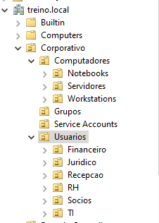
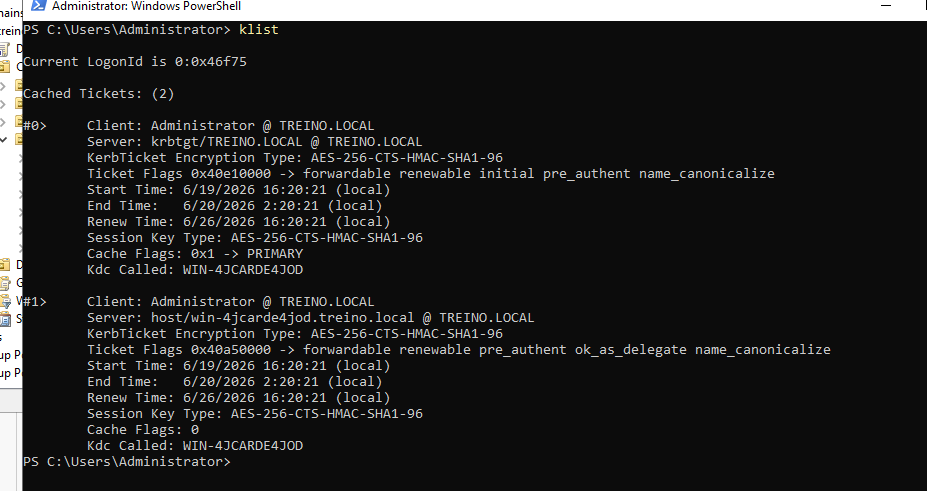
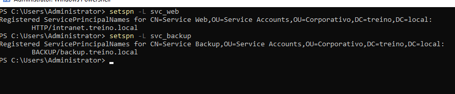
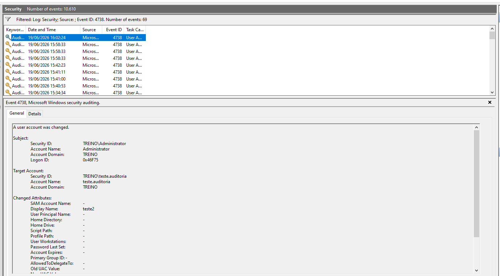
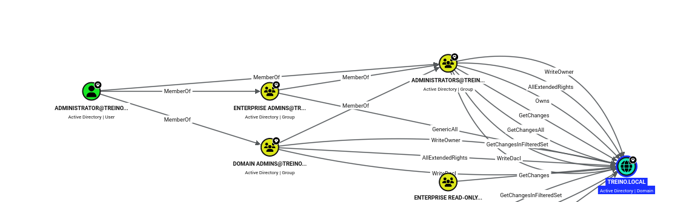
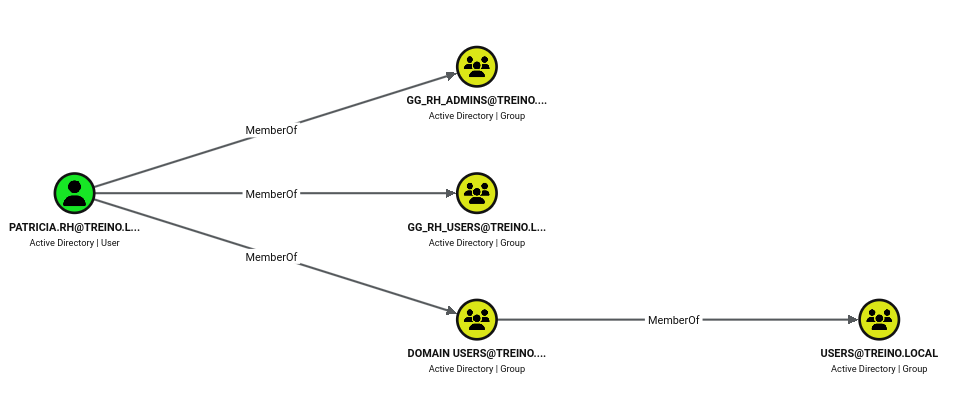
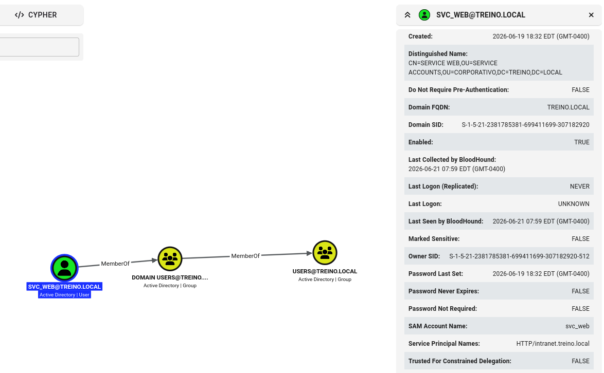

# Active Directory Security Lab

Laboratório de Active Directory desenvolvido para estudo prático de administração e segurança de ambientes Windows.

## Objetivo

Compreender a arquitetura de Active Directory sob a perspectiva de administração e segurança, incluindo autenticação Kerberos, delegação de permissões, auditoria e análise de caminhos de ataque.


## Tecnologias

* Windows Server 2022
* Active Directory Domain Services
* Group Policy Objects (GPO)
* Kerberos
* SMB Shares
* BloodHound CE
* PowerShell
* Windows Event Logs

## Ambiente

Domínio:

```
treino.local
```

Estrutura organizacional:

```
Corporativo
├── Usuarios
├── Computadores
├── Grupos
└── Service Accounts
```

## Implementações

### Usuários e Grupos

* Criação de usuários departamentais
* Grupos de segurança
* Controle de acesso baseado em grupos

### Compartilhamentos SMB

* RH
* Financeiro
* Jurídico
* TI

Permissões configuradas através de grupos do Active Directory.

### Kerberos

Validação de tickets utilizando:

```
klist
```

Análise de autenticação e emissão de tickets de serviço.

### Service Accounts

Contas de serviço criadas:

* svc_web
* svc_backup
* svc_monitor

SPNs registrados para simulação de aplicações corporativas.

### Account Lockout Policy

Implementação de política de bloqueio de contas após múltiplas tentativas de autenticação inválidas.

### Auditoria

Monitoramento de eventos relevantes:

* 4624
* 4625
* 4720
* 4728
* 4738
* 4740

## Screenshots

### Estrutura de OUs



### Kerberos



### Service Accounts e SPNs



### Auditoria



## BloodHound

Coleta realizada utilizando BloodHound Python.

Resultados da enumeração:

* 19 usuários
* 61 grupos
* 11 computadores
* 15 OUs
* 10 GPOs

Análise de relacionamentos entre usuários, grupos, service accounts e permissões do domínio.

### Domain Overview



### User Membership Analysis



### Service Account Analysis




