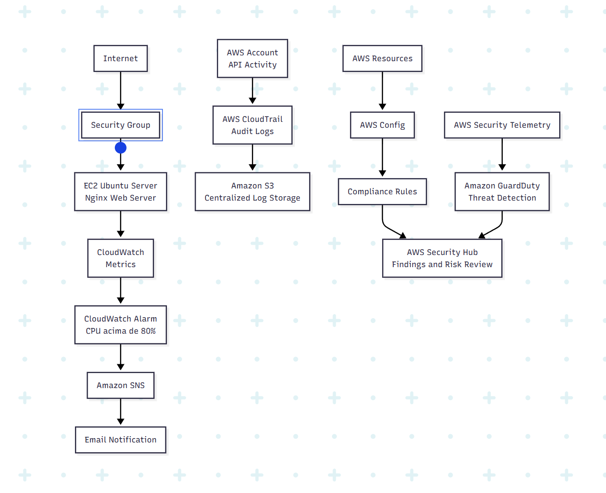
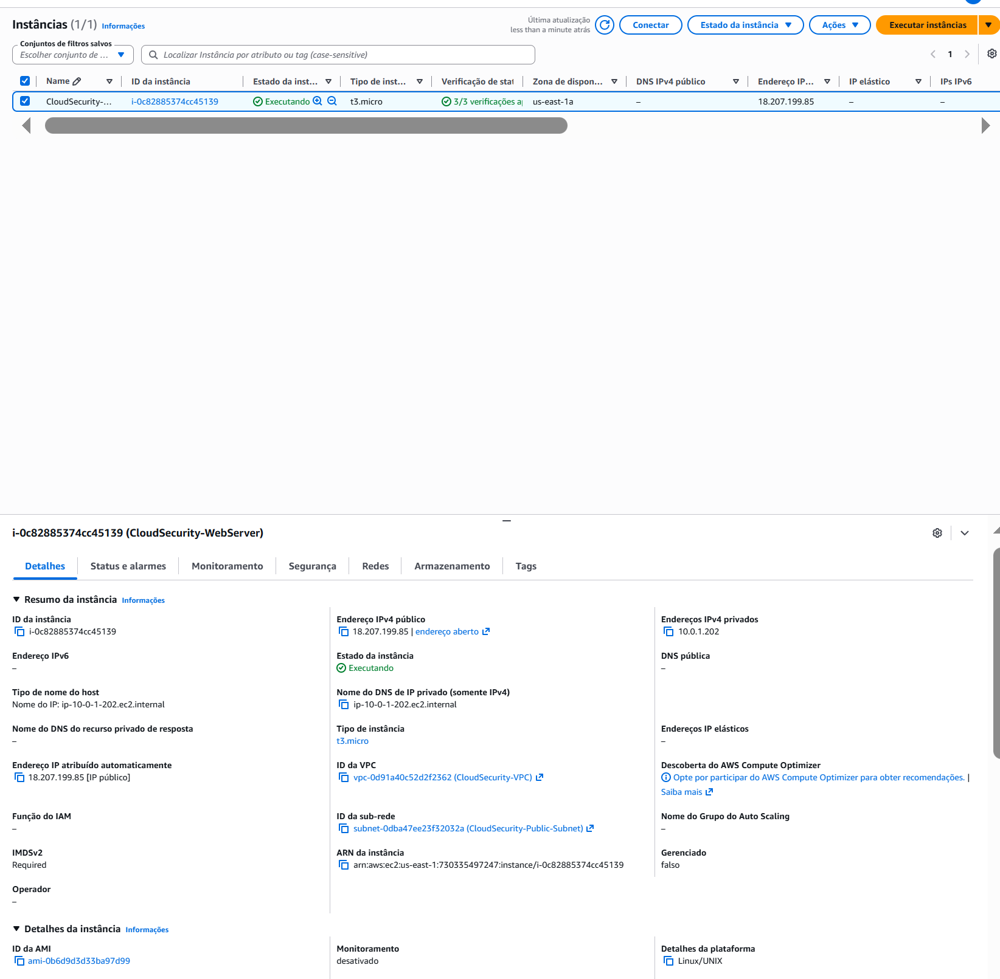
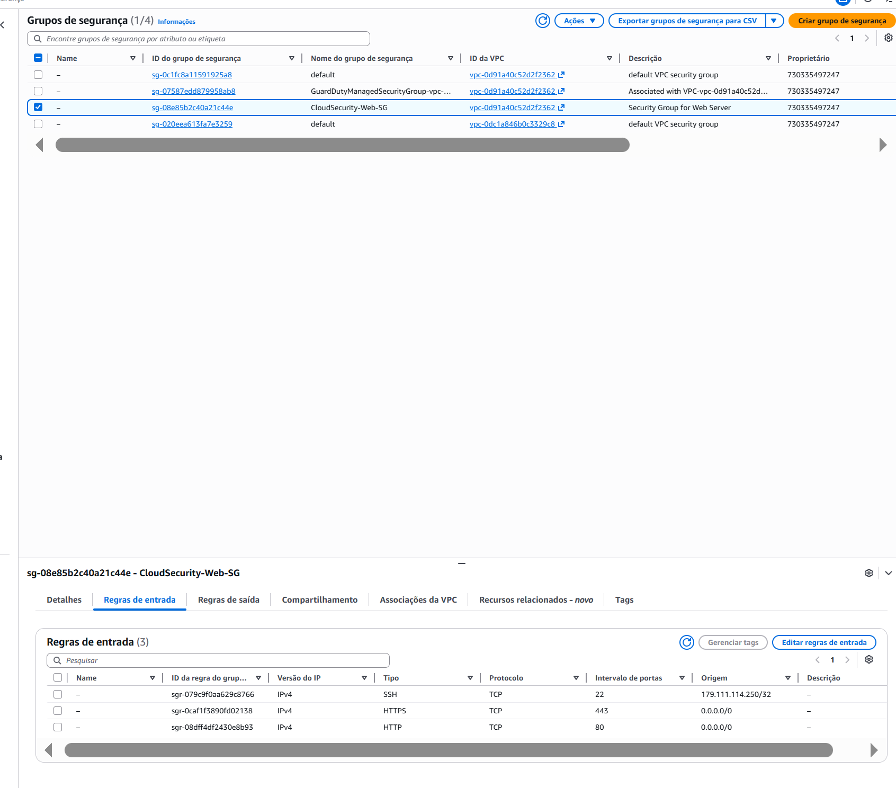
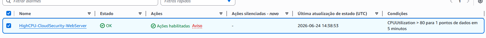
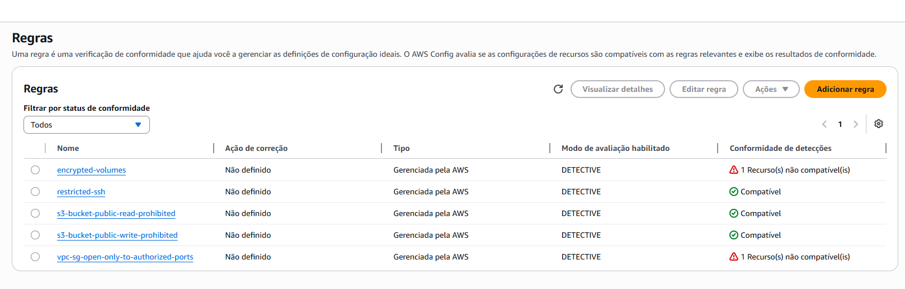
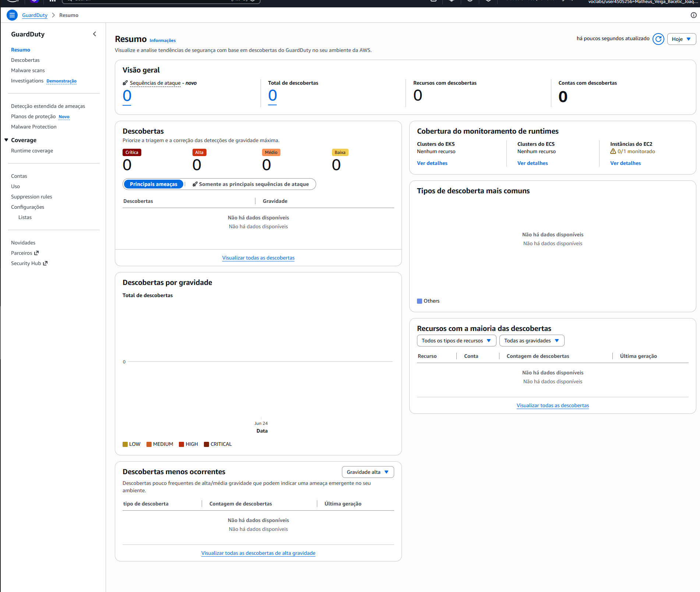
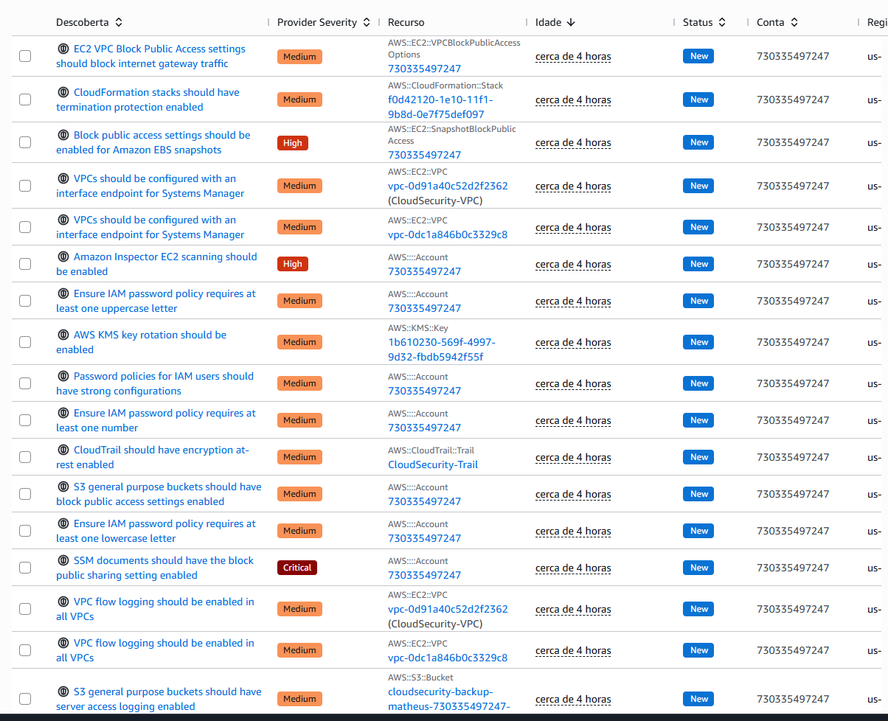
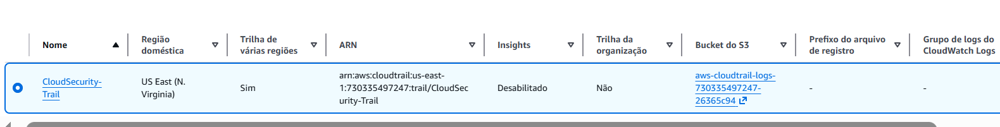

# ☁️ Cloud Security Lab

Projeto prático de Cloud Security desenvolvido na AWS com foco em monitoramento, compliance, auditoria, detecção de ameaças e resposta a incidentes.

O ambiente foi construído utilizando uma conta AWS Academy/Vocareum e teve como objetivo simular controles de segurança encontrados em ambientes corporativos.

---

## 🎯 Objetivo

Implementar e validar controles fundamentais de segurança em nuvem, abrangendo:

* Hardening de infraestrutura
* Monitoramento contínuo
* Compliance e governança
* Auditoria de eventos
* Detecção de ameaças
* Gestão de riscos
* Resposta a incidentes

---

## 🏗️ Arquitetura

```text
Internet
    |
    v
Security Group
    |
    v
EC2 Ubuntu
    |
    +--> Nginx

CloudWatch
    |
    +--> Alarm
            |
            v
           SNS

CloudTrail
    |
    v
S3

AWS Config

GuardDuty

Security Hub
```



---

## 🔧 Tecnologias e Serviços Utilizados

### Compute

* Amazon EC2 (Ubuntu Server)
* Nginx

### Monitoramento

* Amazon CloudWatch
* Amazon SNS

### Compliance

* AWS Config
* AWS Config Rules

### Auditoria

* AWS CloudTrail
* Amazon S3

### Threat Detection

* Amazon GuardDuty
* AWS Security Hub

---

## 🛡️ Controles de Segurança Implementados

| Controle                  | Status |
| ------------------------- | ------ |
| Security Groups           | ✅      |
| Hardening Linux           | ✅      |
| Nginx Hardened            | ✅      |
| CloudWatch Metrics        | ✅      |
| CloudWatch Alarms         | ✅      |
| SNS Notifications         | ✅      |
| AWS Config                | ✅      |
| Compliance Rules          | ✅      |
| CloudTrail                | ✅      |
| GuardDuty                 | ✅      |
| Security Hub              | ✅      |
| Incident Response Process | ✅      |
| Risk Management           | ✅      |

---

## 📋 Compliance Rules

Implementadas através do AWS Config:

| Rule                                 | Status          |
| ------------------------------------ | --------------- |
| restricted-ssh                       | ✅ Compliant     |
| s3-bucket-public-read-prohibited     | ✅ Compliant     |
| s3-bucket-public-write-prohibited    | ✅ Compliant     |
| encrypted-volumes                    | ❌ Non-Compliant |
| vpc-sg-open-only-to-authorized-ports | ❌ Non-Compliant |

---

## 🚨 Security Findings

### Finding 1 — Public EC2 Exposure

**Severidade:** High

A instância EC2 utiliza IPv4 público para permitir acesso administrativo via SSH e hospedagem do servidor Nginx.

**Controles Compensatórios**

* Security Groups
* Linux Hardening
* CloudTrail
* CloudWatch
* GuardDuty
* Security Hub

**Status:** Risk Accepted

---

### Finding 2 — Public SSM Documents

**Severidade:** Critical

Finding identificado pelo Security Hub referente à configuração de compartilhamento público de documentos SSM.

**Status:** Risk Accepted

---

## 🔍 Incident Response

Durante o projeto foram conduzidas investigações e documentações formais de incidentes relacionados a limitações do ambiente e findings de segurança.

### Incidentes Documentados

| ID     | Descrição                          | Status |
| ------ | ---------------------------------- | ------ |
| IR-001 | GuardDuty → SNS Failure            | Closed |
| IR-002 | Amazon Inspector Permission Denied | Closed |
| IR-003 | Security Hub Critical Finding      | Closed |
| IR-004 | Public EC2 Exposure                | Closed |

Documentação completa disponível em:

```text
docs/incidents/
```

---

## 📸 Evidências

### EC2 Running



### Security Groups



### CloudWatch Alarm



### AWS Config Rules



### GuardDuty



### Security Hub



### CloudTrail



---

## ⚠️ Limitações do Ambiente

Este projeto foi desenvolvido em uma conta AWS Academy/Vocareum com restrições administrativas.

Restrições identificadas:

* iam:CreateRole → AccessDenied
* inspector2:BatchGetAccountStatus → AccessDenied
* Athena/DataZone → AccessDenied

Impactos:

* Integração GuardDuty → EventBridge → SNS não pôde ser concluída
* Amazon Inspector não pôde ser ativado
* Amazon Athena não pôde ser utilizado para threat hunting

Todas as limitações foram documentadas e tratadas como incidentes formais.

---

## 📚 Aprendizados

Durante o desenvolvimento deste laboratório foram praticados conceitos de:

* Cloud Security
* Linux Hardening
* Security Groups
* Cloud Monitoring
* Compliance Assessment
* Cloud Auditing
* Threat Detection
* Incident Response
* Risk Management
* AWS Security Services

---

## 📂 Estrutura do Projeto

```text
cloud-cyber/
│
├── README.md
│
├── docs/
│   ├── network.md
│   ├── hardening.md
│   ├── auditing.md
│   ├── security-assessment.md
│   │
│   └── incidents/
│       ├── IR-001-guardduty-sns-failure.md
│       ├── IR-002-inspector-permission-denied.md
│       ├── IR-003-securityhub-critical-finding.md
│       └── IR-004-public-ec2-exposure.md
│
├── screenshots/
│
└── architecture/
```
