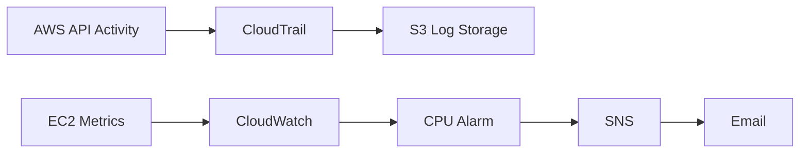

# Auditoria e Monitoramento

## Objetivo

Manter a rastreabilidade das ações realizadas na conta AWS e gerar alertas sobre o comportamento operacional da instância EC2.

## Fluxos Implementados

## AWS CloudTrail

Foi criada uma trail para registrar eventos de gerenciamento da conta. Os logs são entregues em um bucket Amazon S3 e possuem validação de integridade habilitada.

Durante a investigação, foram observados, entre outros, os seguintes eventos:

| Evento | Resultado | Contexto |
|---|---|---|
| `PutRule` | Registrado | Tentativa de integração com EventBridge |
| `CreateRole` | AccessDenied | Restrição de IAM do AWS Academy |
| `DeleteRule` | Registrado | Remoção da regra após falha da integração |

Esses registros foram utilizados na análise da causa raiz do incidente `IR-001`.

## CloudWatch e SNS

O CloudWatch foi configurado para acompanhar métricas da EC2. Um alarme de CPU acima de 80% aciona um tópico SNS, que envia uma notificação para o e-mail confirmado.

O fluxo foi validado por meio de um teste de carga na instância.

## Evidências Produzidas

- Trail ativa e entrega de logs no S3.
- Validação de logs do CloudTrail habilitada.
- Histórico dos eventos `PutRule`, `CreateRole` e `DeleteRule`.
- Alarme do CloudWatch em estado de alerta durante o teste.
- Assinatura SNS confirmada e notificação recebida.
- Incident Reports armazenados em `docs/incidents/`.

## Limitação de Análise

O Amazon Athena não pôde ser utilizado para consultas centralizadas dos logs porque a role do laboratório não possui a permissão `datazone:ListDomains`. A restrição impede o threat hunting por SQL, mas não afeta a coleta e a preservação dos eventos pelo CloudTrail e pelo S3.
