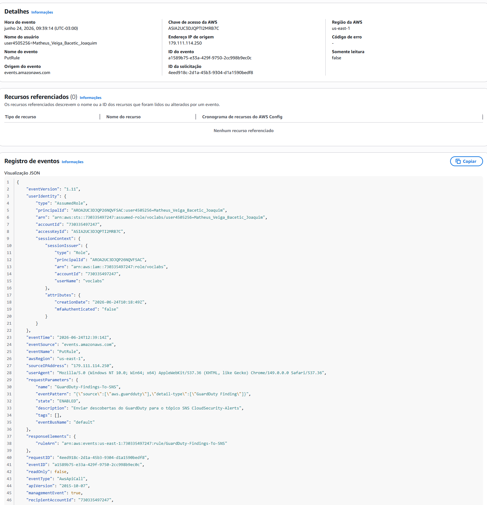
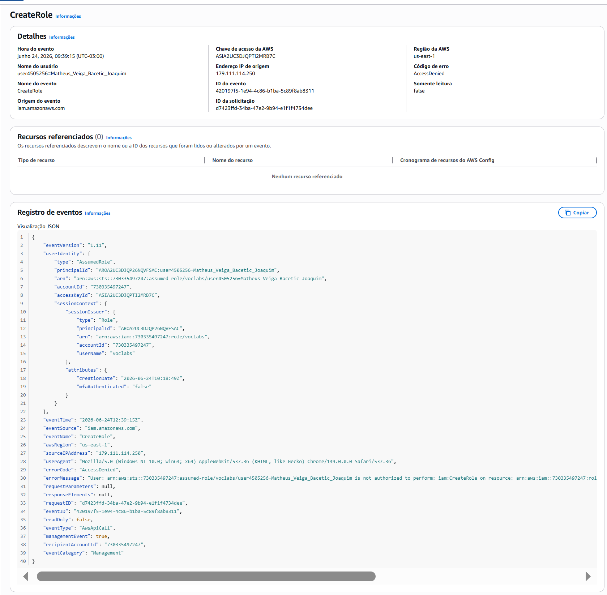
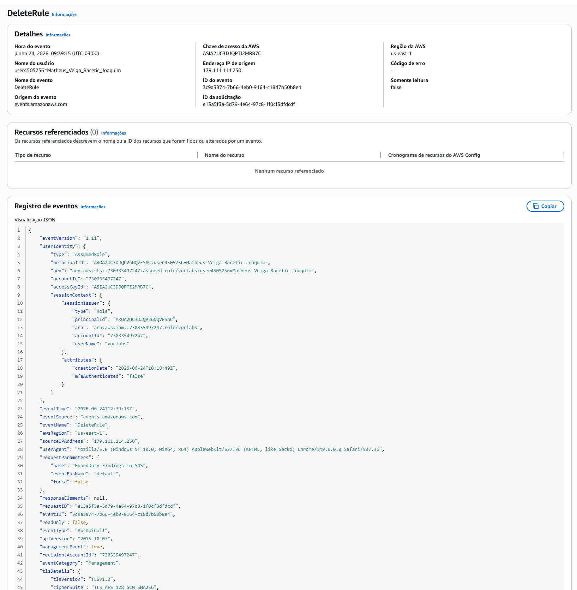

# Incident Report – IR-001

## Título

Falha na Integração GuardDuty → SNS via EventBridge

## Data

24/06/2026

## Objetivo

Implementar uma automação para envio de alertas do Amazon GuardDuty para um tópico SNS utilizando Amazon EventBridge.

## Eventos Observados

* PutRule
* CreateRole
* DeleteRule

## Descrição

Durante a implementação da integração entre Amazon GuardDuty e Amazon SNS, foi criada uma regra no Amazon EventBridge para capturar eventos do tipo GuardDuty Finding.

A criação da regra ocorreu com sucesso. Entretanto, durante a configuração do destino SNS, o AWS EventBridge tentou criar uma IAM Role necessária para executar a integração.

A operação foi bloqueada pela política de permissões do ambiente AWS Academy Learner Lab.

## Impacto

A integração automática entre GuardDuty e SNS não pôde ser concluída.

Como consequência, descobertas geradas pelo GuardDuty não são encaminhadas automaticamente para o tópico SNS configurado.

## Evidências

### CloudTrail Event History

**PutRule**

* Regra EventBridge criada com sucesso.

**CreateRole**

* Resultado: AccessDenied
* Serviço: IAM
* Operação: iam:CreateRole

**DeleteRule**

* Remoção da regra após falha na configuração.

## Root Cause

Restrição de permissões IAM imposta pelo ambiente AWS Academy Learner Lab.

A conta utilizada não possui autorização para executar a ação:

iam:CreateRole

necessária para criação automática da Role utilizada pelo EventBridge.

## Ações Executadas

* Investigação dos eventos no CloudTrail.
* Validação do erro de permissão.
* Confirmação da limitação do laboratório.
* Documentação da ocorrência.

## Status

Fechado.

## Conclusão

A falha não foi causada por erro de configuração da solução proposta.

A causa raiz foi uma restrição administrativa do ambiente de laboratório, impedindo a criação da IAM Role necessária para concluir a integração GuardDuty → SNS.
