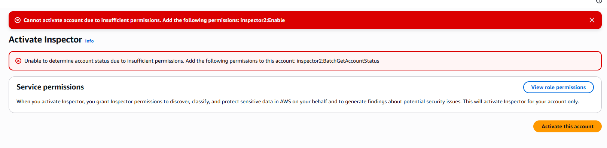

# Incident Report – IR-002

## Título

Falha na Ativação do Amazon Inspector

## Data

24/06/2026

## Objetivo

Habilitar o Amazon Inspector para realizar análise contínua de vulnerabilidades na instância EC2 utilizada no laboratório.

## Detecção

O Security Hub gerou o finding:

Amazon Inspector EC2 scanning should be enabled

Severidade:

High

## Descrição

Durante a análise de postura de segurança realizada no AWS Security Hub, foi identificado que o Amazon Inspector não estava habilitado para análise de vulnerabilidades em instâncias EC2.

Foi iniciada a tentativa de ativação do serviço Amazon Inspector.

## Impacto

A instância EC2 não pode ser analisada automaticamente para:

* Vulnerabilidades conhecidas (CVEs)
* Pacotes desatualizados
* Exposição de software vulnerável

## Evidências

### Security Hub

Finding:
Amazon Inspector EC2 scanning should be enabled

Severity:
High

### Amazon Inspector

Erro apresentado:

inspector2:BatchGetAccountStatus

Unable to determine account status due to insufficient permissions.

## Root Cause

A conta AWS Academy Learner Lab não possui permissões suficientes para administração do Amazon Inspector.

## Ações Executadas

* Investigação do finding no Security Hub.
* Acesso ao console do Amazon Inspector.
* Tentativa de ativação do serviço.
* Validação do erro de permissão.

## Status

Fechado.

## Conclusão

O finding foi validado e documentado. A remediação não pôde ser executada devido às restrições do ambiente de laboratório.
