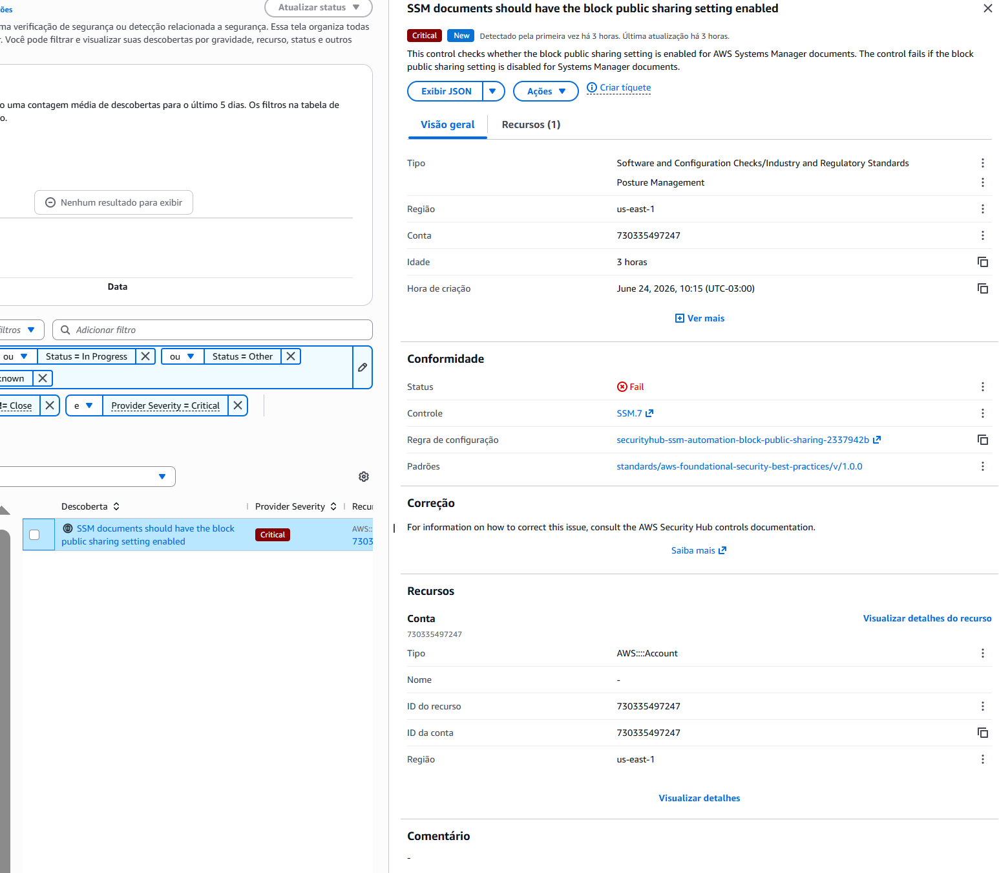

# Incident Report – IR-003

## Título

Finding Crítico no Security Hub – SSM Public Sharing

## Data

24/06/2026

## Objetivo

Investigar finding crítico identificado pelo AWS Security Hub.

## Detecção

Finding:

SSM documents should have the block public sharing setting enabled

Severidade:

Critical

Controle:

SSM.7

## Descrição

O AWS Security Hub identificou que a configuração de bloqueio de compartilhamento público para documentos do AWS Systems Manager (SSM) não estava habilitada.

Esta configuração reduz o risco de exposição indevida de documentos de automação utilizados pelo serviço.

## Impacto

Potencial compartilhamento inadequado de documentos SSM.

Nenhuma evidência de exploração foi identificada.

## Evidências

### Security Hub

Controle:
SSM.7

Framework:
AWS Foundational Security Best Practices

Status:
FAIL

## Root Cause

Configuração global da conta AWS não compatível com a recomendação de segurança.

## Ações Executadas

* Investigação do finding.
* Validação do controle SSM.7.
* Análise da documentação AWS.
* Avaliação de impacto.

## Status

Risk Accepted.

## Conclusão

O finding foi registrado e analisado.

A correção não foi realizada devido às limitações administrativas do ambiente AWS Academy e à ausência de risco operacional relevante para o laboratório.
