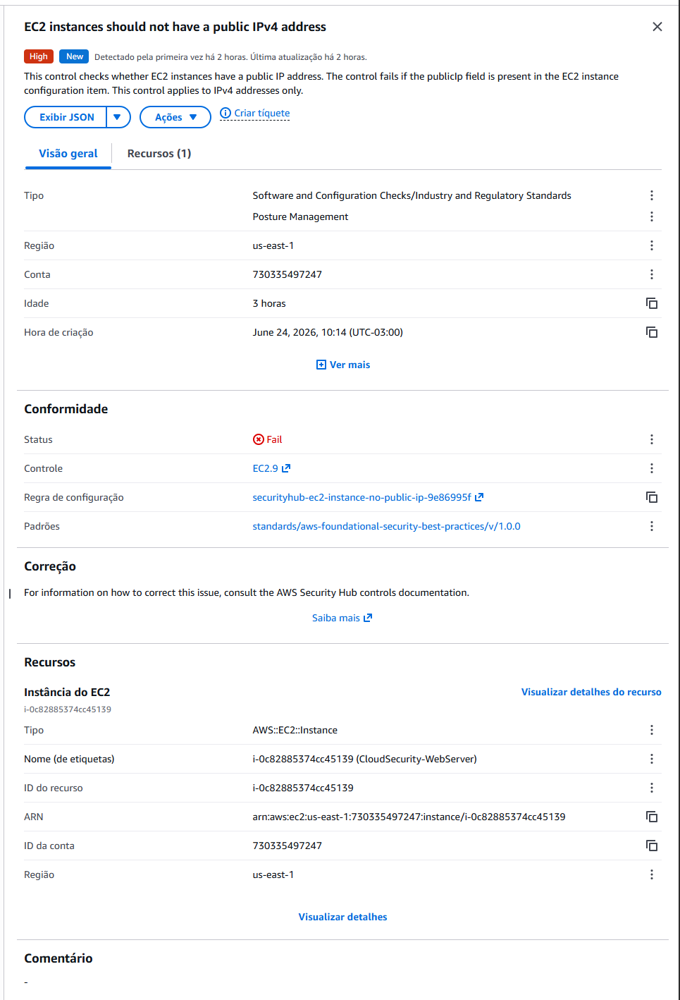

# Incident Report – IR-004

## Título

Instância EC2 Exposta com IPv4 Público

## Data

24/06/2026

## Objetivo

Analisar finding de exposição identificado pelo AWS Security Hub.

## Detecção

Finding:

EC2 instances should not have a public IPv4 address

Severidade:

High

## Descrição

O Security Hub identificou que a instância EC2 utilizada no laboratório possui endereço IPv4 público acessível pela Internet.

## Impacto

A exposição pública aumenta a superfície de ataque do ambiente.

Possíveis riscos:

* Tentativas de brute force
* Reconhecimento externo
* Exploração de serviços vulneráveis

## Evidências

### Security Hub

Finding:
EC2 instances should not have a public IPv4 address

Severity:
High

### Recurso afetado

CloudSecurity-WebServer

## Controles Compensatórios

O ambiente possui:

* Security Groups restritivos
* Hardening básico do sistema operacional
* CloudTrail habilitado
* GuardDuty habilitado
* Security Hub habilitado
* AWS Config habilitado
* CloudWatch Monitoring

## Root Cause

Necessidade operacional do laboratório para disponibilização pública da aplicação web utilizada nos testes.

## Status

Risk Accepted.

## Conclusão

O endereço IPv4 público foi mantido para permitir acesso externo ao ambiente de demonstração.

Os riscos foram reduzidos através da aplicação de controles compensatórios de monitoramento, auditoria e hardening.
