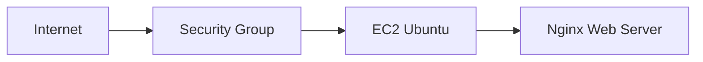

# Rede e Controle de Acesso

## Objetivo

Documentar a conectividade da instância EC2 e os controles utilizados para reduzir sua superfície de exposição.

## Fluxo de Rede

A instância utiliza um endereço IPv4 público para os exercícios do laboratório, o acesso administrativo e a publicação do Nginx. O Security Group atua como firewall da instância e permite somente os acessos necessários.

## Regras de Entrada

| Protocolo | Porta | Origem | Finalidade |
|---|---:|---|---|
| TCP | 22 | IP administrativo autorizado | Acesso SSH |
| TCP | 80 | Internet | Acesso ao Nginx |

O acesso SSH não deve permanecer aberto para `0.0.0.0/0`. A origem deve ser limitada ao IP utilizado para administração.

## Controles Aplicados

- Restrição das portas de entrada no Security Group.
- Restrição do SSH a uma origem administrativa conhecida.
- Separação entre acesso administrativo e tráfego da aplicação.
- Revisão de conformidade por meio do AWS Config.
- Registro de alterações no Security Group pelo CloudTrail.

## Validação de Compliance

| AWS Config Rule | Resultado |
|---|---|
| `restricted-ssh` | Compliant |
| `vpc-sg-open-only-to-authorized-ports` | Non-compliant |

O resultado non-compliant foi mantido como finding para análise. Ele indica a necessidade de revisar as portas autorizadas e suas origens, mesmo que a exposição tenha sido criada para fins de laboratório.

## Risco Residual

A utilização de IPv4 público aumenta a superfície de ataque. O risco foi aceito no contexto educacional e está documentado no incidente `IR-004`, com Security Groups, hardening, CloudWatch, CloudTrail, GuardDuty e Security Hub como controles compensatórios.
