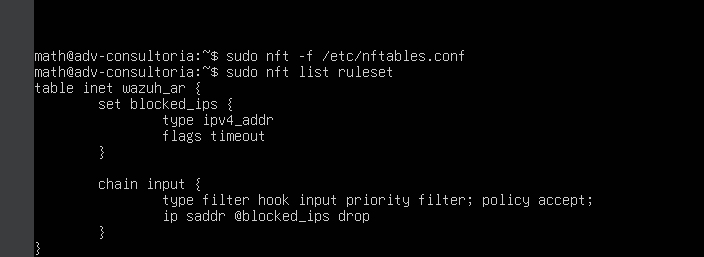
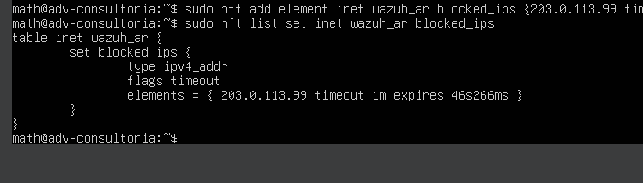
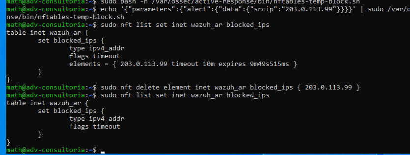
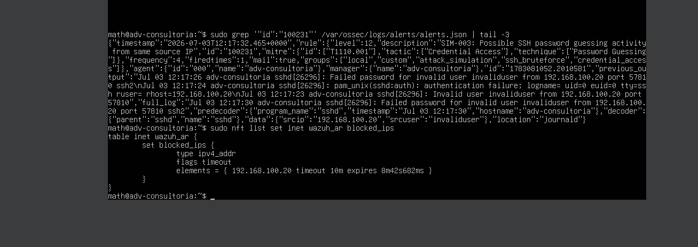

## Step 1 — nftables baseline

A minimal nftables ruleset was created on the Ubuntu Wazuh server to support temporary Active Response blocking.

The ruleset uses:
- `policy accept` to avoid accidental service disruption;
- a dedicated `blocked_ips` set;
- `flags timeout` to allow temporary blocks;
- source IP based blocking only.

This design avoids permanent firewall changes and keeps rollback simple.

## Step 2 — Temporary block and rollback validation

A temporary test IP was added to the `blocked_ips` nftables set with a 60-second timeout.

The test was then manually removed before expiration to validate rollback.

No production lab endpoint was used during this validation. The test IP `203.0.113.99` is reserved for documentation and does not represent an active host.

This confirms that the blocking mechanism is temporary, source-specific, and reversible.

## Step 3 — Temporary nftables block script

A custom Wazuh Active Response script was created at:

`/var/ossec/active-response/bin/nftables-temp-block.sh`

The script receives the Wazuh alert JSON through standard input, extracts `data.srcip`, and inserts only that source IP into the nftables `blocked_ips` set for 10 minutes.

Safety controls:
- localhost is excluded;
- the Domain Controller (`192.168.100.10`) is excluded;
- only IPv4 addresses are accepted;
- no permanent nftables rule is created;
- timeout-based removal is handled by nftables.

Permissions were restricted to `root:wazuh`, and Bash syntax was validated before integration.

## Step 4 — Manual Active Response script validation

The custom response script was tested with a simulated Wazuh alert JSON containing a reserved documentation IP address.

The script successfully extracted `data.srcip` and inserted the address into the nftables `blocked_ips` set with a 10-minute timeout.

The entry was then manually removed to validate rollback before connecting the script to the Wazuh rule trigger.

## Step 5 — Detection-to-response validation

A controlled SSH password-guessing simulation was executed from Kali Linux (`192.168.100.20`) against the Ubuntu Wazuh server.

Wazuh correlated repeated SSH authentication failures and generated custom rule `100231` with:
- Rule level: 12
- Frequency threshold: 4 events
- MITRE ATT&CK: T1110.001 — Password Guessing
- Source IP: `192.168.100.20`

The Wazuh Active Response workflow executed the custom `nftables-temp-block.sh` script. The script inserted the source IP into the nftables `blocked_ips` set with a 10-minute timeout.

The response was source-specific, temporary, and did not affect localhost, the Domain Controller (`192.168.100.10`), or the host-only administrative path.

A manual rollback was performed by removing the Kali IP from the nftables set, restoring SSH connectivity immediately.

