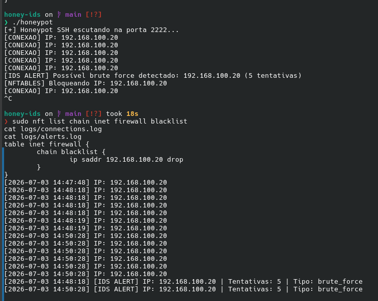
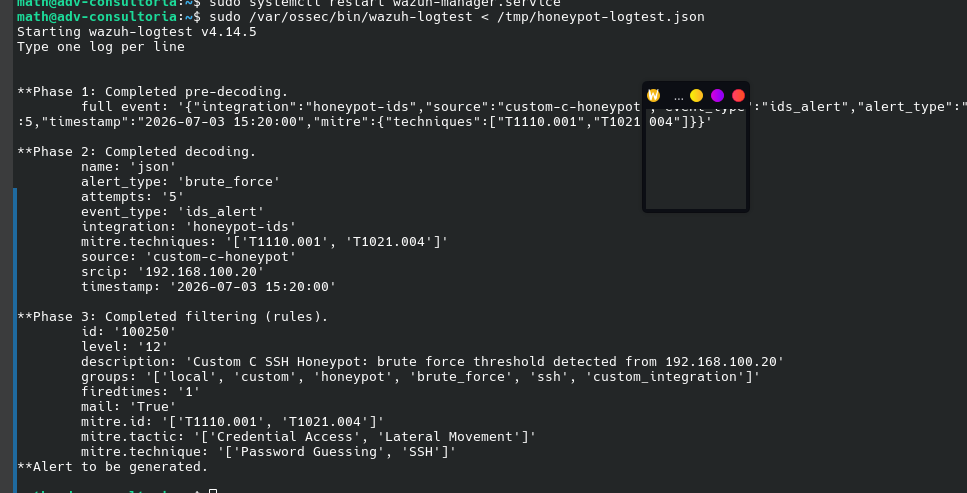
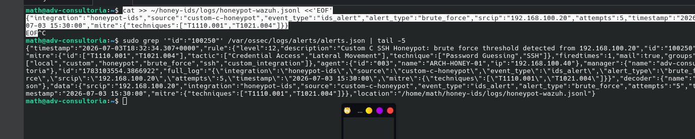

# Sprint 11 - Honeypot SIEM Integration

## Overview

This sprint integrated an existing SSH Honeypot + IDS written in C with the SOC Home Lab, using Wazuh as the centralized SIEM.

The goal was not to recreate the honeypot. The sprint focused on connecting a custom Linux security tool to the SOC pipeline through structured logging, Wazuh Agent collection, custom detection logic, MITRE ATT&CK mapping, response validation, and incident documentation.

## Objectives

- Reuse the existing C-based SSH Honeypot + IDS project.
- Deploy the honeypot as a dedicated Linux sensor.
- Convert IDS alerts into structured JSON Lines telemetry.
- Configure the Wazuh Agent to collect the custom JSONL log.
- Create and validate a Wazuh rule for honeypot brute force activity.
- Map the detection to MITRE ATT&CK.
- Validate the full pipeline from controlled attack simulation to Wazuh alert.
- Document the security controls and evidence.

## Environment

| Component | Hostname | IP Address | Role |
|---|---|---:|---|
| Kali Linux | `kali` | `192.168.100.20` | Controlled attacker simulation |
| Honeypot Sensor | `ARCH-HONEY-01` | `192.168.100.40` | Custom SSH honeypot sensor |
| Wazuh Manager | `adv-consultoria` | `192.168.100.30` | SIEM, log analysis, and alerting |
| Windows Server Domain Controller | `WIN-SERVER-DC` | `192.168.100.10` | Active Directory environment |

## Integration Architecture

```text
Kali Linux
192.168.100.20
        |
        | TCP/2222 controlled SSH connection attempts
        v
ARCH-HONEY-01
192.168.100.40
        |
        | SSH Honeypot + IDS written in C
        | logs/connections.log
        | logs/alerts.log
        v
honeypot_export.py
        |
        | logs/honeypot-wazuh.jsonl
        v
Wazuh Agent
        |
        | TCP/1514
        v
Wazuh Manager
192.168.100.30
        |
        | JSON decoder
        | Base rule 86600
        | Custom rule 100250
        v
Wazuh Alert
```

## Existing Honeypot Project

The honeypot integrated in this sprint was previously developed in C and published as a standalone project:

```text
honeypot-ids/
```

Core capabilities:

- Simulates an SSH service on TCP port `2222`.
- Returns an SSH banner to connecting clients.
- Logs source IP addresses.
- Detects repeated connection attempts.
- Generates a brute force alert after five attempts.
- Adds a source IP block rule through nftables.

This sprint focused on SIEM integration and did not redesign the honeypot source code.

## SIEM Integration Flow

1. Kali Linux generates controlled connections against TCP port `2222`.
2. The C honeypot records each connection in `logs/connections.log`.
3. After five attempts from the same source IP, the IDS writes a brute force event to `logs/alerts.log`.
4. `honeypot_export.py` reads only new IDS alerts.
5. The exporter appends structured JSON events to `logs/honeypot-wazuh.jsonl`.
6. Wazuh Agent on `ARCH-HONEY-01` collects the JSONL file.
7. Wazuh Manager decodes the event using the JSON decoder.
8. The event matches base rule `86600`.
9. Custom child rule `100250` generates a high-severity alert.

## Detection Rule

| Field | Value |
|---|---|
| Rule ID | `100250` |
| Severity | `12` |
| Detection | Custom C SSH Honeypot brute force threshold |
| Parent Rule | `86600` |
| Source | `honeypot-ids` JSON integration |
| Trigger | `alert_type=brute_force` |
| Threshold | Five connection attempts |
| Source IP | `data.srcip` |
| MITRE ATT&CK | `T1110.001`, `T1021.004` |

## MITRE ATT&CK Mapping

| Tactic | Technique | ID |
|---|---|---|
| Credential Access | Password Guessing | `T1110.001` |
| Lateral Movement | SSH | `T1021.004` |

## Validation

The following chain was validated successfully:

```text
Kali controlled connection attempts
        |
        v
C Honeypot SSH service
        |
        v
IDS brute force detection
        |
        v
alerts.log
        |
        v
incremental Python JSONL exporter
        |
        v
Wazuh Agent
        |
        v
Wazuh JSON decoder
        |
        v
Base rule 86600
        |
        v
Custom rule 100250
        |
        v
Wazuh Alert Level 12
```

The final Wazuh alert included:

| Field | Value |
|---|---|
| Agent | `ARCH-HONEY-01` |
| Source IP | `192.168.100.20` |
| Alert type | `brute_force` |
| Attempts | `5` |
| Rule ID | `100250` |
| MITRE ATT&CK | `T1110.001`, `T1021.004` |

## Security Controls

The honeypot sensor uses nftables with a default deny policy.

Only the Kali simulation host was allowed to reach the honeypot service:

| Source | Destination | Protocol | Port |
|---|---|---|---:|
| `192.168.100.20` | `192.168.100.40` | TCP | `2222` |

When the IDS threshold was reached, the honeypot inserted a blocking rule for the source IP in the nftables blacklist chain.

## Evidence

| Evidence | Description |
|---|---|
|  | Existing C honeypot project structure |
|  | Wazuh Agent collecting honeypot JSONL telemetry |
|  | Final Wazuh alert generated by custom rule `100250` |

## Skills Demonstrated

- Linux endpoint monitoring
- Wazuh Agent deployment
- Custom log collection
- JSON Lines structured logging
- Python log export automation
- Wazuh rule engineering
- Parent/child rule logic
- MITRE ATT&CK mapping
- SSH brute force detection
- nftables response integration
- Incident documentation
- SOC investigation workflow

## Lessons Learned

- Custom security tools can be integrated into a SIEM without rewriting the original application.
- JSON Lines is a practical format for structured log ingestion.
- Wazuh custom rules should inherit from the base rule that receives the decoded event.
- SIEM integrations should be validated at every stage: source log, structured output, agent collection, archive event, rule test, and final alert.
- Separating the honeypot sensor from the Wazuh Manager improves operational safety and reflects real SOC architecture.

## Scope Control

This sprint intentionally did not create dashboards or refactor the full C honeypot codebase.

The focus was integrating an existing custom detection tool into the SOC Home Lab and validating the complete detection pipeline.

## Status

Sprint 11 completed.

The C-based SSH Honeypot + IDS was successfully integrated with Wazuh as a structured telemetry source. Custom rule `100250` successfully detected controlled brute force activity from the honeypot JSONL output.
